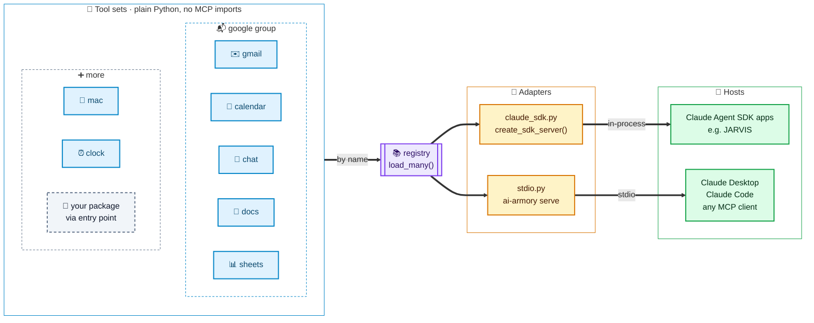
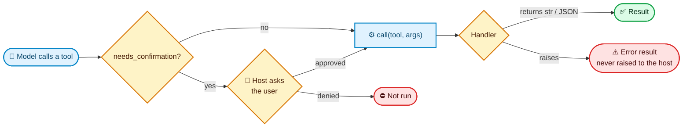
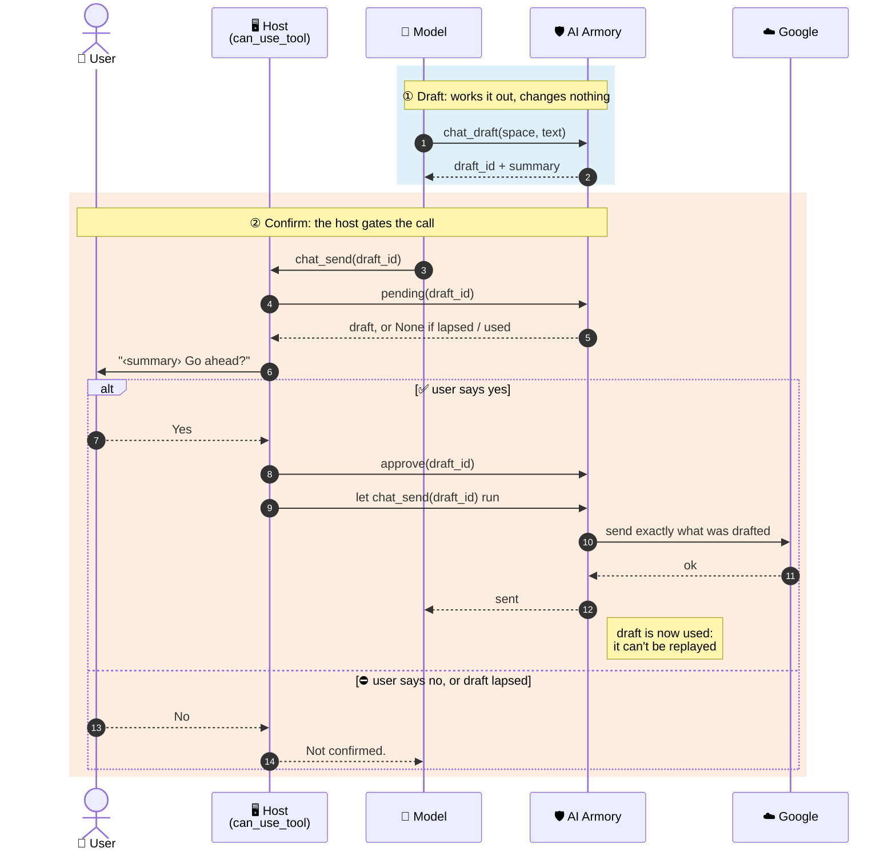
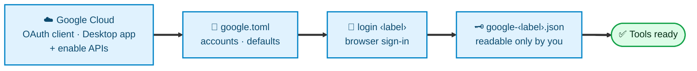

<div align="center">

# 🛡️ AI Armory

**A collection of MCP tool sets, written once in plain Python and served anywhere.**


</div>

> [!NOTE]
> **TL;DR:** Each tool set (Google Workspace and Mac control today, with GitHub and more planned) is a separate module that can be loaded on its own and doesn't depend on any MCP library. Load the tool sets you want, then serve them **in-process** to the Claude Agent SDK or **over stdio** to any MCP client.

---

## 📑 Contents

- [How it works](#-how-it-works)
- [Install](#-install)
- [Use it standalone (stdio)](#-use-it-standalone-stdio)
- [Use it in-process (Claude Agent SDK)](#-use-it-in-process-claude-agent-sdk)
- [Confirmation](#-confirmation)
- [The Google tool sets](#-the-google-tool-sets)
- [The Mac tool set](#-the-mac-tool-set)
- [Adding a tool set](#-adding-a-tool-set)
- [Layout](#-layout)
- [Development](#-development)

---

## 🧭 How it works



| Mode | Built on | Typical host |
|---|---|---|
| **In-process** | [Claude Agent SDK](https://github.com/anthropics/claude-agent-sdk-python) MCP server | JARVIS, a voice assistant built on the SDK |
| **Standalone** | Official [`mcp`](https://github.com/modelcontextprotocol/python-sdk) SDK, over stdio | Claude Desktop, Claude Code, any MCP client |

### Available tool sets

| Tool set | What it does | Extra |
|---|---|---|
| `clock` | Current date and time, in any IANA time zone | `clock` |
| `gmail` · `calendar` · `chat` · `docs` · `sheets` | Google Workspace across many accounts ([details](#-the-google-tool-sets)) | `google` |
| `google` *(group)* | All five Google tool sets at once | `google` |
| `mac` | Notifications, apps and links, Apple Shortcuts and the volume on this Mac ([details](#-the-mac-tool-set)) | `mac` |

---

## 📦 Install

```sh
pip install -e ".[all]"       # everything
pip install -e ".[sdk,clock]" # the Agent SDK adapter and the clock tool set
pip install -e ".[google]"    # the Google tool sets (gmail, calendar, chat, docs, sheets)
```

| Extra | Installs |
|---|---|
| `sdk` | `claude-agent-sdk`, for the in-process adapter |
| `clock` | the `clock` tool set |
| `google` | the Google client libraries, shared by all five Google tool sets |
| `mac` | nothing more: the `mac` tool set runs macOS's own programs |
| `all` | `sdk` + `clock` + `google` + `mac` |
| `dev` | `all` + `pytest` + `anyio` |

> [!TIP]
> Each tool set has its **own extra** holding only what it needs, so you install the dependencies of the tool sets you use and nothing else.

---

## 🖥️ Use it standalone (stdio)

```sh
ai-armory list                        # see the tool sets
ai-armory serve --toolsets clock      # serve chosen tool sets over stdio
ai-armory serve --toolsets google     # a group: gmail, calendar, chat, docs and sheets
ai-armory serve --toolsets mac,clock  # several, comma-separated
ai-armory serve                       # serve every installed tool set
```

<details open>
<summary><b>Claude Code</b></summary>

```sh
claude mcp add ai-armory -- ai-armory serve --toolsets clock
```

</details>

<details open>
<summary><b>Claude Desktop</b> (<code>claude_desktop_config.json</code>)</summary>

```json
{
  "mcpServers": {
    "ai-armory": { "command": "ai-armory", "args": ["serve", "--toolsets", "clock"] }
  }
}
```

</details>

---

## 🐍 Use it in-process (Claude Agent SDK)

```python
from claude_agent_sdk import ClaudeAgentOptions
from ai_armory import load_many
from ai_armory.adapters.claude_sdk import create_sdk_server, confirmation_required

toolsets = load_many(["clock"])
options = ClaudeAgentOptions(mcp_servers={"ai-armory": create_sdk_server(toolsets)})

# Full tool names (mcp__ai-armory__...) the host should confirm with the user
# before running, e.g. from a can_use_tool callback.
gated = confirmation_required(toolsets)
```

---

## ✅ Confirmation

Tools that send, delete or otherwise act on the world are declared with `needs_confirmation=True`.

> [!IMPORTANT]
> **AI Armory never prompts.** It only carries the flag, so the host can gate the call.



| Where | How the flag reaches the host |
|---|---|
| **In-process** | `confirmation_required(toolsets)` returns the tool names |
| **Over stdio** | such tools carry `"_meta": {"ai-armory/needsConfirmation": true}` in `tools/list`; clients that don't know the key ignore it |
| **Both** | `read_only=True` is sent as the standard MCP `readOnlyHint` annotation |

---

## 📬 The Google tool sets

Gmail, Google Calendar, Google Chat, Google Docs and Google Sheets across **any number of Google accounts**. Each is its own tool set, so you load only what you need, or all five as the `google` group.

| Tool set | 👀 Reads (read-only) | ✏️ Changes | 🔒 Needs confirmation |
|---|---|---|---|
| `gmail` | `gmail_search`, `gmail_read` | `gmail_create_draft`, `gmail_modify` (read/unread, archive, star, labels) | — |
| `calendar` | `calendar_events`, `calendar_draft_invite` | `calendar_create_event` (nobody invited) | `calendar_send_invite` |
| `chat` | `chat_unread`, `chat_spaces`, `chat_read`, `chat_search`, `chat_draft` | `chat_mark_read` (the user's own read state) | `chat_send` |
| `docs` | `docs_search`, `docs_read`, `docs_draft_delete` | `docs_beautify`, `docs_format`, `docs_replace_text`, `docs_insert`, `docs_insert_image` | `docs_delete` |
| `sheets` | `sheets_search`, `sheets_read`, `sheets_draft_delete_tab` | `sheets_write`, `sheets_append`, `sheets_add_tab`, `sheets_format` | `sheets_delete_tab` |

### Accounts

| Tools | Which account they use |
|---|---|
| **Searches** (`gmail_search`, `calendar_events`, `chat_unread`, `chat_search`) | Every account unless one is named; an account that fails is left out with a note |
| **Everything else** | One account, defaulting to the default account (for Chat, the first account with Chat) |

An account can be named by its **label** or its **email**.

### 🛑 What it will never do

> [!CAUTION]
> Nothing here **sends email** (drafts wait in Gmail's Drafts), **trashes or deletes mail**, **deletes a document or spreadsheet**, or **deletes a row**.
>
> The tools that return other people's text (mail, chat, docs) tell the model, in their descriptions, **not to follow instructions in it**.

### Sends and deletes: draft, then confirm

Everything that sends something to other people or deletes something is **two tools**:

| Step | Tools | What it does |
|---|---|---|
| **1. Draft** | `chat_draft`, `calendar_draft_invite`, `docs_draft_delete`, `sheets_draft_delete_tab` | Works out exactly what would happen, **changes nothing**, returns a `draft_id` and a `summary` to put to the user |
| **2. Confirm** | `chat_send`, `calendar_send_invite`, `docs_delete`, `sheets_delete_tab` | Takes **only** the `draft_id`, so what happens is exactly what was drafted; declared `needs_confirmation` |



**Guarantees:**

- A deletion is **pinned to the document revision** it was worked out from, so if the doc changed in between, nothing is deleted.
- A draft is **used once at most** and lapses after `draft_minutes`.
- With `host_approval` on (the default), the confirming tool also **refuses any draft the host hasn't approved**, so even a misconfigured gate can't send:

```python
from ai_armory.toolsets.google import approve, pending

async def can_use_tool(name, args, ctx):          # e.g. the SDK's can_use_tool
    if name in gated:                             # confirmation_required(toolsets)
        draft = pending(args["draft_id"])         # None if lapsed or used
        if draft and await ask_user(draft.summary + " Go ahead?"):
            approve(args["draft_id"])
            return PermissionResultAllow()
        return PermissionResultDeny(message="Not confirmed.")
    ...
```

> [!TIP]
> **Standalone MCP clients** can't call `approve`. If your client asks you before each tool call it hasn't been told to allow (Claude Desktop and Claude Code do), set `host_approval = false` and **leave the confirming tools off its always-allow list**, so that prompt is the confirmation.

### ⚙️ Configure



#### 1. Create an OAuth client

In a Google Cloud project, create an OAuth client of type **Desktop app**, download its JSON, and turn on the APIs you'll use:

| Tool set | APIs to enable |
|---|---|
| `gmail` | Gmail |
| `calendar` | Google Calendar |
| `docs` | Google Drive, Google Docs |
| `sheets` | Google Drive, Google Sheets |
| `chat` | Google Chat API (with a Chat app configured on its Configuration page) and the People API |

#### 2. List your accounts

Put them in `~/.config/ai-armory/google.toml`, or any file named by `$AI_ARMORY_GOOGLE_CONFIG`:

```toml
default = "work"                  # gets whatever is made without naming an account; default: the first
timezone = "Europe/London"        # for calendar events and the times shown; default UTC
token_dir = "google"              # where sign-ins are kept, relative to this file; this is the default
client_secret = "~/Downloads/client_secret.json"  # used only to sign in
# user_name = "Sam"               # how results name the user; default "the user"
# host_approval = true            # see above
# draft_minutes = 10
# sign_in_command = "python -m ai_armory.toolsets.google login {label}"  # shown when a sign-in is needed
# image_folder = "AI Armory doc images"   # Drive folder for images from this machine
# blocked_paths = ["~/private"]   # never uploaded by docs_insert_image, besides keys, tokens and secrets folders

[[accounts]]
label = "work"                    # what the tools take as account: lowercase letters, digits, - and _
email = "me@example.com"          # optional; lets the model name the account by email
description = "for work"          # optional; passed to the model in the account field's description
chat = true                       # a Workspace account with Google Chat

[[accounts]]
label = "personal"
```

#### 3. Sign each account in

This opens a browser and stores the account's token in `<token_dir>/google-<label>.json`, **readable only by you**:

```sh
python -m ai_armory.toolsets.google login work
python -m ai_armory.toolsets.google            # list accounts and whether each is signed in
python -m ai_armory.toolsets.google check-chat # check Google Chat works
```

> [!NOTE]
> An account with `chat = true` also asks for Google Chat's **narrow scopes**: read-only, create-only for sending and starting a DM, and the user's own read state. If a Workspace admin blocks that, sign-in offers to try again without reading messages, then without Chat; `chat_unread` then falls back to Chat's notification emails.
>
> **Sign in again to replace a token**, e.g. after the tools gain a permission. The tools say so when one is missing.

#### Or configure in code

A host running the tools in-process can configure them in code instead, **before loading them** (their schemas list the accounts as they are when loaded):

```python
from ai_armory.toolsets.google import Account, GoogleSettings, configure

configure(GoogleSettings(
    accounts=[Account("work", "me@example.com", "for work", chat=True), Account("personal")],
    token_dir="~/my-host/secrets",
    sign_in_command="my-host accounts login {label}",
))
toolsets = load_many(["google"])
```

| Helper | Gives the host |
|---|---|
| `GoogleSettings.describe()` | A line on the accounts for the host's own prompt |
| `ai_armory.toolsets.google.chat.news(label)` | The unread DMs and mentions, for the host's own alerts |

---

## 🍎 The Mac tool set

Control of the Mac the tools run on, through macOS's own programs, so there's **nothing to install or configure**. It works only on macOS; elsewhere it loads, but each call says it needs macOS.

| Tool | 👀 Read-only | What it runs |
|---|---|---|
| `mac_notify` | | Shows a notification (`osascript`, `display notification`) |
| `mac_open` | | Opens an app by name (`open -a`), or an `http(s)://` link (`open`) |
| `mac_run_shortcut` | | Runs an Apple Shortcut by exact name, with optional text input (`shortcuts run`), for up to 2 minutes |
| `mac_list_shortcuts` | ✅ | Lists the Apple Shortcuts (`shortcuts list`) |
| `mac_set_volume` | | Sets the output volume, kept between 0 and 100 (`osascript`, `set volume`) |

> [!IMPORTANT]
> **Arguments go to programs as argv, never through a shell**, and a notification's text reaches AppleScript as arguments, not as script. Nothing here needs confirmation; a host that wants a yes before opening apps or running shortcuts can gate them itself.

```sh
ai-armory serve --toolsets mac
```

The first time, macOS may ask whether the program running the server (your terminal, or the MCP client) may control the Mac or show notifications.

A host can also show a notification of its own, outside any tool call:

```python
from ai_armory.toolsets.mac import notify

await notify("Build", "Finished.")
```

---

## 🧩 Adding a tool set

**1. Create** `src/ai_armory/toolsets/<name>.py` with a module-level `toolset`:

```python
from ai_armory import ToolError, ToolSet

toolset = ToolSet("notes", "Keep short notes.")

@toolset.tool(
    "add",
    "Save a note.",
    {"properties": {"text": {"type": "string"}}, "required": ["text"]},
    needs_confirmation=True,
)
async def add(args):
    if not args["text"].strip():
        raise ToolError("Empty note")  # becomes an error result for the model
    ...
    return "Saved."  # a string, or anything JSON-serialisable
```

Tools are exposed with the **tool set name as a prefix** (`notes_add`). The input schema is a JSON Schema object; `type: object` is filled in for you.

**2. Register** it in `BUILTIN` in [`src/ai_armory/registry.py`](src/ai_armory/registry.py).

**3. Add an extra** for its dependencies in [`pyproject.toml`](pyproject.toml). Import them inside the tool set module, not anywhere shared.

**4. Add tests** under [`tests/`](tests/).

> [!TIP]
> **Tool sets can also live in other packages:** point an entry point in the `ai_armory.toolsets` group at a `ToolSet` object and AI Armory will find it.

---

## 🗂️ Layout

```
src/ai_armory/
├── core.py            Tool, ToolSet, ToolError, call(): the neutral definitions
├── registry.py        finding and loading tool sets by name
├── cli.py             the `ai-armory` command
├── adapters/
│   ├── claude_sdk.py  in-process Claude Agent SDK server
│   └── stdio.py       standalone stdio MCP server
└── toolsets/          one module per tool set
    ├── clock.py
    ├── mac.py         notifications, apps and links, Apple Shortcuts, volume
    └── google/        settings, shared clients, drafts, sign-in,
                       and gmail, calendar, chat, docs (+ docs_write, docs_images), sheets
```

---

## 🛠️ Development

```sh
pip install -e ".[dev]"
pytest
```

---

## 📄 Licence

**MIT**, see [LICENSE](LICENSE).
