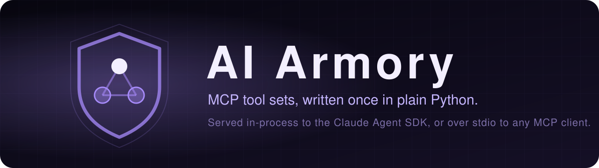
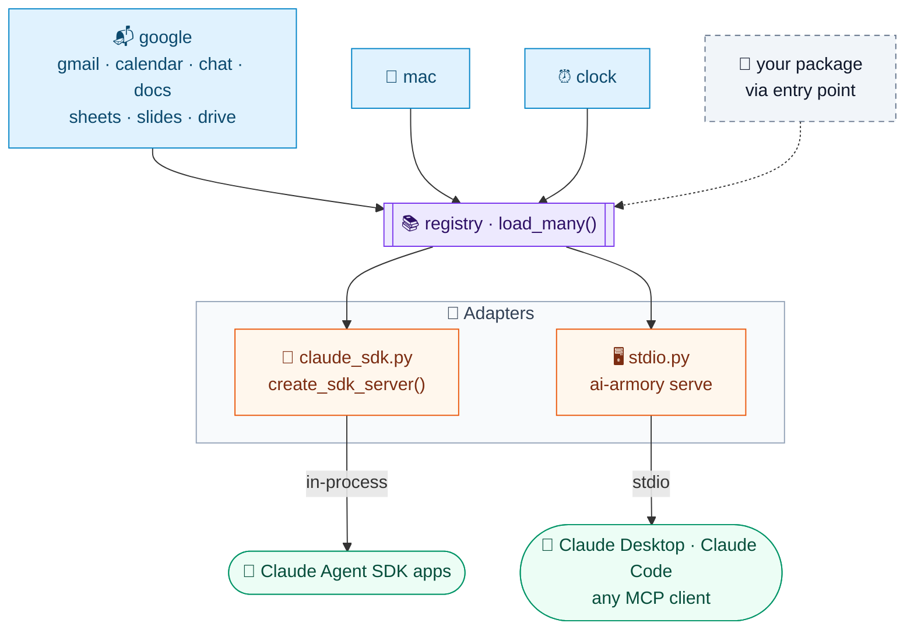

<div align="center">



<br>

[](LICENSE)
[](pyproject.toml)
[](docs/serving.md)
[](docs/serving.md#-in-process-claude-agent-sdk)

**[🔌 Serving](docs/serving.md)** &nbsp;·&nbsp; **[📬 Google](docs/google.md)** &nbsp;·&nbsp; **[🍎 Mac](docs/mac.md)** &nbsp;·&nbsp; **[🧩 Writing a tool set](docs/toolsets.md)**

</div>

---

AI Armory is a **collection of MCP tool sets**: Google Workspace and Mac control today, with GitHub and more planned.
Each tool set is a **separate module you can load on its own**, written in **plain Python with no MCP imports**.
Load the ones you want, then serve them **in-process to the Claude Agent SDK** or **over stdio to any MCP client**.

<table>
<tr>
<td width="33%" valign="top">

### 🐍 Plain Python

A tool is an `async` function plus a JSON Schema. No MCP library in sight.

</td>
<td width="33%" valign="top">

### 📦 Only what you use

Each tool set has **its own extra**, so you install only its dependencies.

</td>
<td width="33%" valign="top">

### 🔒 Safe by design

Sends and deletes are **flagged for the host to confirm**. AI Armory never prompts.

</td>
</tr>
</table>

## ✨ Tool sets

<table>
<tr>
<td width="50%" valign="top">

**[📬 Google Workspace](docs/google.md)**<br>
`gmail` · `calendar` · `chat` · `docs` · `sheets` · `slides` · `drive` across **any number of accounts**, or all seven as the `google` group.

</td>
<td width="50%" valign="top">

**[🍎 Mac](docs/mac.md)**<br>
Notifications, apps and links, Apple Shortcuts, the volume and the clipboard on this Mac. **Nothing to configure.**

</td>
</tr>
<tr>
<td width="50%" valign="top">

**⏰ Clock**<br>
`clock`: the current date and time, in any IANA time zone.

</td>
<td width="50%" valign="top">

**[🧩 Your own](docs/toolsets.md)**<br>
Add a module here, or ship one in **another package** through an entry point.

</td>
</tr>
</table>

## 🧭 How it fits together



- **Tool sets** (blue) are plain Python with no MCP imports; the **registry** loads them **by name**.
- **Adapters** turn the same tool sets into an in-process SDK server or a stdio MCP server.

| Mode | Built on | Typical host |
|---|---|---|
| **In-process** | [Claude Agent SDK](https://github.com/anthropics/claude-agent-sdk-python) MCP server | Your own Agent SDK app, e.g. a voice assistant |
| **Standalone** | Official [`mcp`](https://github.com/modelcontextprotocol/python-sdk) SDK, over stdio | Claude Desktop, Claude Code, any MCP client |

## 🚀 Quickstart

> [!IMPORTANT]
> Needs **Python 3.11+**. The `mac` tool set works only on macOS; the rest run anywhere.

**1. Install** — everything, or just the extras you need:

```sh
pip install -e ".[all]"
```

**2. Look around** — list the tool sets this install can load:

```sh
ai-armory list
```

**3. Connect a client** — for example, Claude Code serving the clock:

```sh
claude mcp add ai-armory -- ai-armory serve --toolsets clock
```

> [!TIP]
> Claude Desktop config, the in-process adapter and how confirmation reaches the host are in **[🔌 Serving](docs/serving.md)**.
> The Google tool sets need a one-time sign-in: see **[📬 Google › Configure](docs/google.md#-configure)**.

## 📦 Install extras

```sh
pip install -e ".[all]"       # everything
pip install -e ".[sdk,clock]" # the Agent SDK adapter and the clock tool set
pip install -e ".[google]"    # the Google tool sets (gmail, calendar, chat, docs, sheets, slides, drive)
```

| Extra | Installs |
|---|---|
| `sdk` | `claude-agent-sdk`, for the in-process adapter |
| `clock` | the `clock` tool set |
| `google` | the Google client libraries, shared by all seven Google tool sets |
| `gmail` · `calendar` · `chat` · `docs` · `sheets` · `slides` · `drive` | the same as `google` |
| `mac` | nothing more: `mac` runs macOS's own programs |
| `all` | `sdk` + `clock` + `google` + `mac` |
| `dev` | `all` + `pytest` + `anyio` |

## 🧰 Everyday commands

| | Command | What it does |
|:-:|---|---|
| 📋 | `ai-armory list` | See the tool sets |
| 🔌 | `ai-armory serve --toolsets clock` | Serve chosen tool sets over stdio |
| 📬 | `ai-armory serve --toolsets google` | A group: all seven Google tool sets |
| ➕ | `ai-armory serve --toolsets mac,clock` | Several, comma-separated |
| 🌐 | `ai-armory serve` | Serve every installed tool set |
| 🔑 | `python -m ai_armory.toolsets.google login work` | Sign a Google account in |

- `serve --name <name>` sets the server name reported to the client (default `ai-armory`).

## 📚 Documentation

<table>
<tr>
<td width="50%" valign="top">

**[🔌 Serving](docs/serving.md)**<br>
Standalone over stdio, in-process with the Agent SDK, and how confirmation reaches the host.

</td>
<td width="50%" valign="top">

**[📬 Google](docs/google.md)**<br>
Every Google tool, accounts, the draft-then-confirm flow, and setup.

</td>
</tr>
<tr>
<td width="50%" valign="top">

**[🍎 Mac](docs/mac.md)**<br>
The seven Mac tools, what each runs, and macOS permissions.

</td>
<td width="50%" valign="top">

**[🧩 Writing a tool set](docs/toolsets.md)**<br>
Adding a tool set, plugins from other packages, the code layout and tests.

</td>
</tr>
</table>

## 🔐 Safety at a glance

- Tools that send, delete or otherwise act on the world are declared **`needs_confirmation=True`**; the host gates them.
- Google sends and deletes are **two tools: draft, then confirm**, and a draft can be used once at most.
- Nothing here **sends email without a confirmed draft**, **trashes mail**, **deletes a document, spreadsheet, deck or row**, or **changes, shares or deletes a Drive file**.
- Tools that return other people's text tell the model **not to follow instructions in it**.

Details: [🔌 Serving › Confirmation](docs/serving.md#-confirmation) and [📬 Google › Draft, then confirm](docs/google.md#-sends-and-deletes-draft-then-confirm).

## 🧪 Development

```sh
pip install -e ".[dev]"
pytest
```

See **[🧩 Writing a tool set](docs/toolsets.md)** to add your own.

## 📄 License

**MIT**, see [LICENSE](LICENSE).

---

<div align="center">


<sub>AI Armory · tools for agents, written once</sub>

</div>
