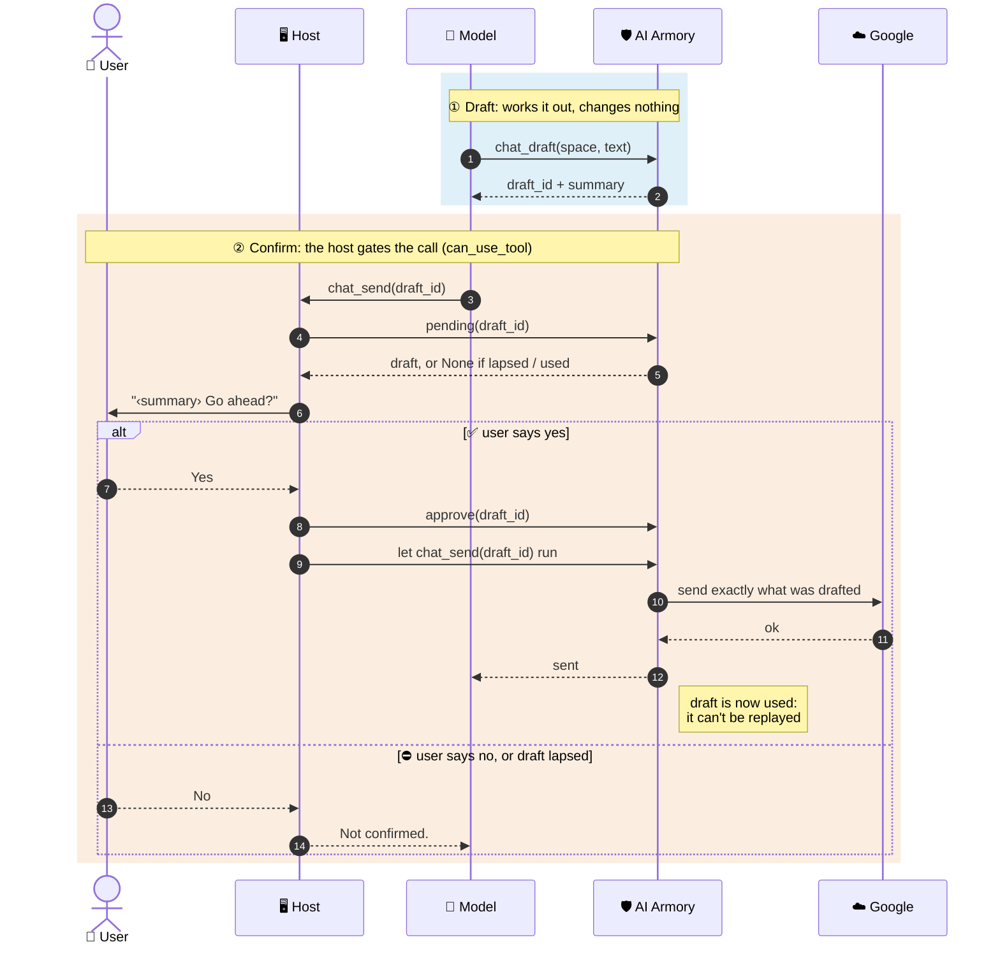
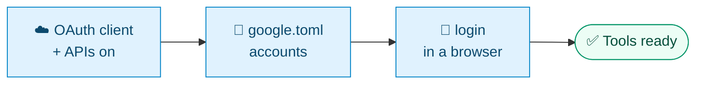

<div align="center">


# 📬 Google

**Gmail, Google Calendar, Google Chat, Google Docs, Google Sheets, Google Slides and Google Drive search across any number of Google accounts.**

[🏠 Home](../README.md) · [🔌 Serving](serving.md) · **📬 Google** · [🍎 Mac](mac.md) · [🧩 Writing a tool set](toolsets.md)

</div>

---

Each service is **its own tool set**, so you load only what you need, or all seven at once as the **`google` group**.

<details>
<summary><b>📑 On this page</b></summary>

- [Tools](#-tools)
- [Accounts](#-accounts)
- [What it will never do](#-what-it-will-never-do)
- [Sends and deletes: draft, then confirm](#-sends-and-deletes-draft-then-confirm)
- [Configure](#-configure)
- [Configure in code](#-configure-in-code)

</details>

## 🧰 Tools

| Tool set | 👀 Reads (read-only) | ✏️ Changes | 🔒 Needs confirmation |
|---|---|---|---|
| `gmail` | `gmail_search`<br>`gmail_read`<br>`gmail_draft_send`<br>`gmail_draft_reply` | `gmail_create_draft`<br>`gmail_modify` | `gmail_send` |
| `calendar` | `calendar_events`<br>`calendar_event`<br>`calendar_free_time`<br>`calendar_draft_invite`<br>`calendar_draft_update`<br>`calendar_draft_respond`<br>`calendar_draft_delete` | `calendar_create_event`<br>`calendar_update_event` | `calendar_send_invite`<br>`calendar_send_update`<br>`calendar_send_response`<br>`calendar_delete_event` |
| `chat` | `chat_unread`<br>`chat_spaces`<br>`chat_read`<br>`chat_search`<br>`chat_draft` | `chat_mark_read` | `chat_send` |
| `docs` | `docs_search`<br>`docs_read`<br>`docs_draft_delete` | `docs_beautify`<br>`docs_format`<br>`docs_replace_text`<br>`docs_insert`<br>`docs_insert_image` | `docs_delete` |
| `sheets` | `sheets_search`<br>`sheets_read`<br>`sheets_draft_delete_tab` | `sheets_write`<br>`sheets_append`<br>`sheets_add_tab`<br>`sheets_format` | `sheets_delete_tab` |
| `slides` | `slides_search`<br>`slides_read` | — | — |
| `drive` | `drive_search` | — | — |

- `gmail_create_draft` saves to Gmail's Drafts, as a reply in its thread if asked.
- `gmail_modify` marks read or unread, archives, stars and changes labels.
- `calendar_create_event` invites **nobody**; invites go through `calendar_send_invite`.
- `calendar_update_event` changes **only events with nobody else on them**; others go through `calendar_send_update`.
- `slides_read` reads a deck slide by slide, **with speaker notes**.
- `drive_search` finds any file or folder by name or content, including files **shared with the user**.
- `chat_mark_read` changes only **the user's own** read state.

## 👥 Accounts

| Tools | Which account they use |
|---|---|
| **Searches**: `gmail_search`, `calendar_events`,<br>`chat_unread`, `chat_search`, `drive_search` | **Every account** unless one is named |
| **Everything else** | **One account**: the default account, or for Chat the first account with Chat |

- In a search across accounts, an account that fails is left out **with a note**.
- An account can be named by its **label** or its **email**.

## 🛑 What it will never do

> [!CAUTION]
> Nothing here **sends email without a confirmed draft** (`gmail_draft_send` or `gmail_draft_reply`, then `gmail_send`), **trashes or deletes mail**, **deletes a document, spreadsheet or deck**, **deletes a row**, or **changes, shares or deletes a Drive file**.
>
> The tools that return other people's text (mail, chat, events, docs, decks) tell the model, in their descriptions, **not to follow instructions in it**.

## 🔏 Sends and deletes: draft, then confirm

Everything that sends something to other people or deletes something is **two tools**:

| Step | Tools | What it does |
|---|---|---|
| **1. Draft** | `gmail_draft_send`<br>`gmail_draft_reply`<br>`chat_draft`<br>`calendar_draft_invite`<br>`calendar_draft_update`<br>`calendar_draft_respond`<br>`calendar_draft_delete`<br>`docs_draft_delete`<br>`sheets_draft_delete_tab` | Works out exactly what would happen and **changes nothing**; returns a `draft_id` and a `summary` |
| **2. Confirm** | `gmail_send`<br>`chat_send`<br>`calendar_send_invite`<br>`calendar_send_update`<br>`calendar_send_response`<br>`calendar_delete_event`<br>`docs_delete`<br>`sheets_delete_tab` | Takes **only** the `draft_id`, so it does exactly what was drafted; declared `needs_confirmation` |

- The `summary` is what the host puts to the user.



**Guarantees**

| | Guarantee | What it means |
|:-:|---|---|
| 📌 | **Pinned** | A deletion is tied to the doc revision it was worked out from; if the doc changed, nothing is deleted |
| 📅 | **Pinned events** | A calendar change or deletion is pinned the same way, to the event's etag |
| ✉️ | **Exact email** | An email's summary names everyone it goes to, **cc and bcc included**, and its exact text |
| 1️⃣ | **Single use** | A draft is used once at most; it can't be replayed |
| ⌛ | **Lapses** | A draft expires after `draft_minutes` |
| 🔐 | **Host approval** | With `host_approval` on (the default), the confirming tool **refuses any draft the host hasn't approved** |

- A reply keeps its thread: Gmail's `threadId`, `In-Reply-To` and `References`, and a `Re:` subject.
- Host approval means even a misconfigured gate can't send. The host's `can_use_tool` approves before allowing:

```python
from ai_armory.toolsets.google import approve, pending

async def can_use_tool(name, args, ctx):          # e.g. the SDK's can_use_tool
    if name in gated:                             # confirmation_required(toolsets)
        draft = pending(args["draft_id"])         # None if lapsed or used
        if draft and await ask_user(draft.summary + " Go ahead?"):
            approve(args["draft_id"])
            return PermissionResultAllow()
        return PermissionResultDeny(message="Not confirmed.")
    ...
```

> [!TIP]
> **Standalone MCP clients** can't call `approve`. If your client asks you before each tool call it hasn't been told to allow (Claude Desktop and Claude Code do), set `host_approval = false` and **leave the confirming tools off its always-allow list**, so that prompt is the confirmation.

## 🔧 Configure



### 1. Create an OAuth client

In a Google Cloud project, create an OAuth client of type **Desktop app**, download its JSON, and turn on the APIs you'll use:

| Tool set | APIs to enable |
|---|---|
| `gmail` | Gmail |
| `calendar` | Google Calendar |
| `docs` | Google Drive, Google Docs |
| `sheets` | Google Drive, Google Sheets |
| `slides` | Google Drive, Google Slides |
| `drive` | Google Drive |
| `chat` | Google Chat API and the People API |

- For `chat`, also configure a Chat app on the Chat API's **Configuration** page.

### 2. List your accounts

Put them in **`~/.config/ai-armory/google.toml`**, or any file named by **`$AI_ARMORY_GOOGLE_CONFIG`**:

```toml
default = "work"                  # gets whatever is made without naming an account; default: the first
timezone = "Europe/London"        # for calendar events and the times shown; default UTC
token_dir = "google"              # where sign-ins are kept, relative to this file; this is the default
client_secret = "~/Downloads/client_secret.json"  # used only to sign in
# user_name = "Sam"               # how results name the user; default "the user"
# host_approval = true            # see "Sends and deletes" above
# draft_minutes = 10
# sign_in_command = "python -m ai_armory.toolsets.google login {label}"  # shown when a sign-in is needed
# image_folder = "AI Armory doc images"   # Drive folder for images from this machine
# never uploaded by docs_insert_image, besides keys, tokens and secrets folders:
# blocked_paths = ["~/private"]

[[accounts]]
label = "work"                    # what the tools take as account: lowercase letters, digits, - and _
email = "me@example.com"          # optional; lets the model name the account by email
description = "for work"          # optional; passed to the model in the account field's description
chat = true                       # a Workspace account with Google Chat

[[accounts]]
label = "personal"
```

### 3. Sign each account in

`login` opens a browser and stores the account's token in `<token_dir>/google-<label>.json`, **readable only by you**:

```sh
python -m ai_armory.toolsets.google login work
python -m ai_armory.toolsets.google            # list accounts and whether each is signed in
python -m ai_armory.toolsets.google check-chat # check Google Chat works
```

> [!NOTE]
> An account with `chat = true` also asks for Google Chat's **narrow scopes**: read-only, create-only for sending and starting a DM, and the user's own read state.
>
> **Sign in again to replace a token**, e.g. after the tools gain a permission. The tools say so when one is missing.

- If a Workspace admin blocks Chat's scopes, sign-in offers to try again **without reading messages**, then **without Chat**.
- Without Chat read access, `chat_unread` falls back to **Chat's notification emails**.

## 🐍 Configure in code

A host running the tools in-process can configure them in code instead, **before loading them**: their schemas list the accounts as they are when loaded.

```python
from ai_armory.toolsets.google import Account, GoogleSettings, configure

configure(GoogleSettings(
    accounts=[Account("work", "me@example.com", "for work", chat=True), Account("personal")],
    token_dir="~/my-host/secrets",
    sign_in_command="my-host accounts login {label}",
))
toolsets = load_many(["google"])
```

| Helper | Gives the host |
|---|---|
| `GoogleSettings.describe()` | A line on the accounts for the host's own prompt |
| `ai_armory.toolsets.google.chat.news(label)` | The unread DMs and mentions, for the host's own alerts |

---

<div align="center">

[← 🔌 Serving](serving.md) &nbsp;·&nbsp; [🏠 Home](../README.md) &nbsp;·&nbsp; [🍎 Mac →](mac.md)

</div>
