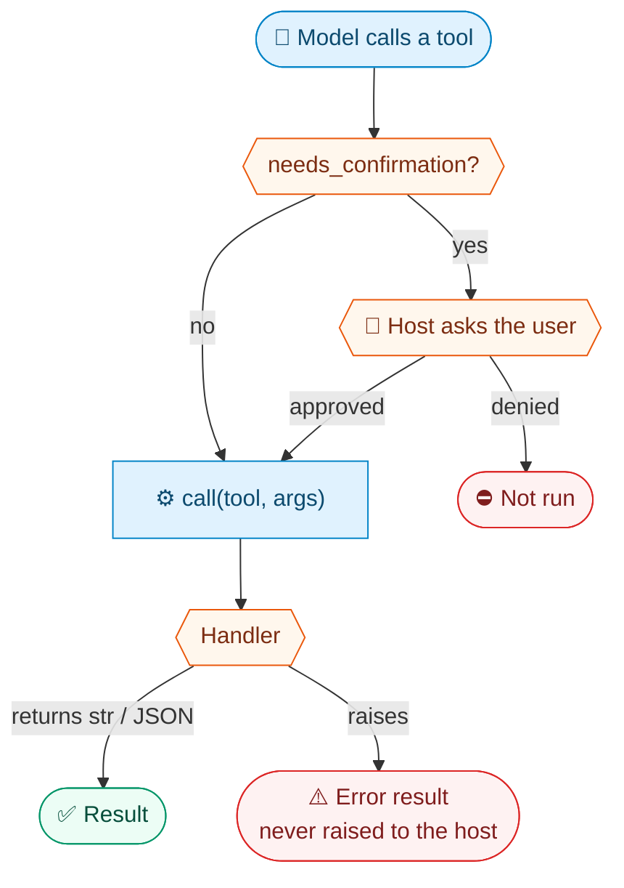

<div align="center">


# 🔌 Serving

**Serve tool sets over stdio to any MCP client, or in-process to the Claude Agent SDK, and gate the risky ones.**

[🏠 Home](../README.md) · **🔌 Serving** · [📬 Google](google.md) · [🍎 Mac](mac.md) · [🧩 Writing a tool set](toolsets.md)

</div>

---

| Mode | Built on | Typical host |
|---|---|---|
| **Standalone** | Official [`mcp`](https://github.com/modelcontextprotocol/python-sdk) SDK, over stdio | Claude Desktop, Claude Code, any MCP client |
| **In-process** | [Claude Agent SDK](https://github.com/anthropics/claude-agent-sdk-python) MCP server | Your own Agent SDK app, e.g. a voice assistant |

## 💻 Standalone (stdio)

```sh
ai-armory list                        # see the tool sets
ai-armory serve --toolsets clock      # serve chosen tool sets over stdio
ai-armory serve --toolsets google     # a group: all seven Google tool sets
ai-armory serve --toolsets mac,clock  # several, comma-separated
ai-armory serve                       # serve every installed tool set
```

- `--name <name>` sets the server name reported to the client; the default is `ai-armory`.

**Claude Code**

```sh
claude mcp add ai-armory -- ai-armory serve --toolsets clock
```

**Claude Desktop** (`claude_desktop_config.json`)

```json
{
  "mcpServers": {
    "ai-armory": { "command": "ai-armory", "args": ["serve", "--toolsets", "clock"] }
  }
}
```

## 🐍 In-process (Claude Agent SDK)

Install the `sdk` extra, load the tool sets, and hand the server to `ClaudeAgentOptions`:

```python
from claude_agent_sdk import ClaudeAgentOptions
from ai_armory import load_many
from ai_armory.adapters.claude_sdk import create_sdk_server, confirmation_required

toolsets = load_many(["clock"])
options = ClaudeAgentOptions(mcp_servers={"ai-armory": create_sdk_server(toolsets)})

# Full tool names (mcp__ai-armory__...) the host should confirm with the user
# before running, e.g. from a can_use_tool callback.
gated = confirmation_required(toolsets)
```

## ✅ Confirmation

Tools that send, delete or otherwise act on the world are declared with **`needs_confirmation=True`**.

> [!IMPORTANT]
> **AI Armory never prompts.** It only carries the flag, so the host can gate the call.



| Where | How the flag reaches the host |
|---|---|
| **In-process** | `confirmation_required(toolsets)` returns the tool names |
| **Over stdio** | `"_meta": {"ai-armory/needsConfirmation": true}` on the tool in `tools/list` |
| **Both** | `read_only=True` is sent as the standard MCP `readOnlyHint` annotation |

- Over stdio, clients that don't know the `_meta` key simply ignore it.
- A handler that raises becomes an **error result for the model**; it is never raised to the host.
- The Google tool sets add a second guard on top: **[draft, then confirm](google.md#-sends-and-deletes-draft-then-confirm)**.

---

<div align="center">

[🏠 Home](../README.md) &nbsp;·&nbsp; [📬 Google →](google.md)

</div>
